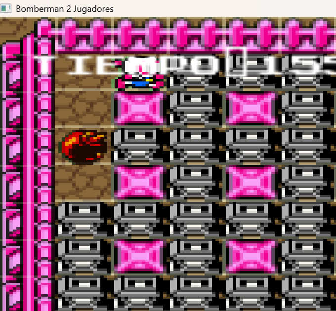
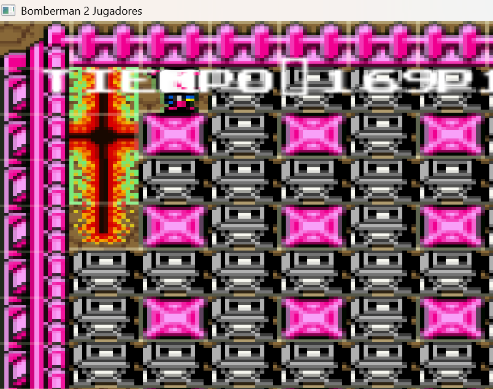
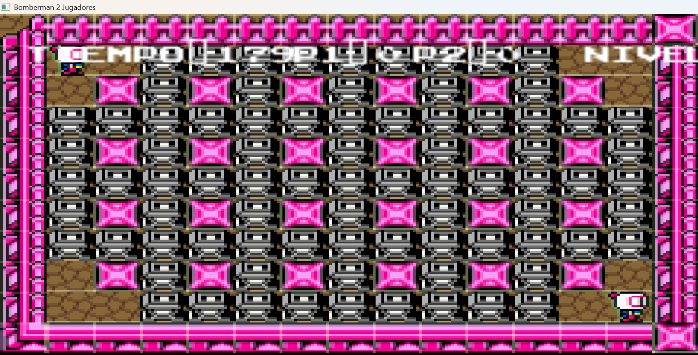

# Bomberman (Proyecto Final)





Este proyecto es una versión simplificada del clásico juego Bomberman desarrollada en C++ utilizando la biblioteca SFML. Permite partidas para dos jugadores con explosiones, power-ups y un sistema de puntaje y niveles.

## Características
- **Gráficos 2D** 
- **Dos jugadores locales**
- **Colocación y explosión de bombas**
- **Power-ups** 
- **Sistema de puntaje y niveles**
- **Música y efectos de sonido**
- **Interfaz de usuario simple**

## Estructura del Proyecto
```
Bomberman/
├── assets/           # Imágenes, sonidos y música
├── bin/              # Ejecutable compilado
├── docs/             # Documentación e imágenes
├── include/          # Archivos de cabecera (.h)
├── src/              # Código fuente principal (.cpp)
├── bomberman.puml    # Diagrama de clases UML (PlantUML)
├── Makefile          # Compilación
├── README.md         # Este archivo
```

## Controles
- **Jugador 1:** W, A, S, D para moverse, Espacio para poner bomba
- **Jugador 2:** Flechas para moverse, Enter para poner bomba

## Créditos
- Proyecto realizado como entrega final para la materia de Programación.

## Registros

- 24110215 
- 23310318


